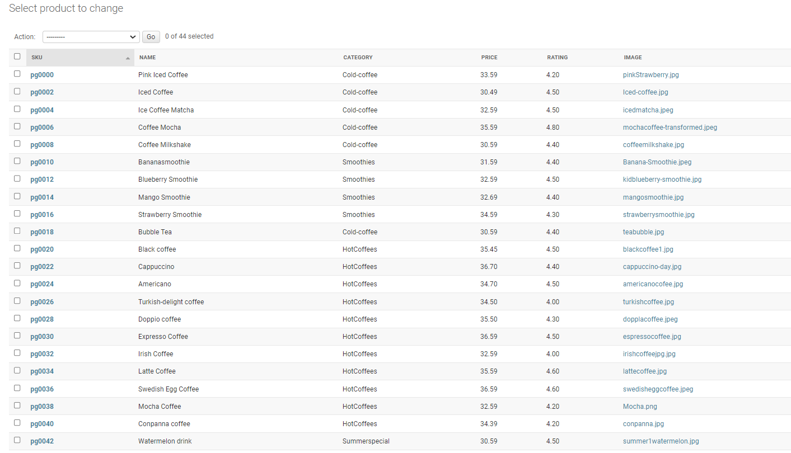

# Project Overview

The coffee house cafe is the coffee shop offering a large number of variety in coffee and fika snacks. This pproject is to create an online portal for the coffee shop as many customers are looking for possibility to order online and get the coffee delevered at their door step. It will help us in extending the customer base and will provide ease to our customers as well. The website does provide information of all the products, where delivery is possible, along with the options for payments. 

Users has to create profile to keep their information avalilabe in shop's database. After that, they just need to login and place an order in few easy steps as need not to repeat stored information while ordering, for example - favorite items, address, etc.

In this project Django, Python, HTML and CSS are used.

# e-Commerce Business Model
The B2C e-commerce business model is followed here as purpose here is to reach to customers directly. With this website, we as a product owner do have possibility to control the list of items, respective selling price. As customers do place the order, we receives payment and start the delivery process immedialtely. 

# Project Objectives
Main objectives concluded for this project are following:
- To create a simple, informative and user friendly userinterface for the customers
- To provide possibility for user to create a profile and save his/her information for future use
- Possibility to order with or without login to get delivery at their place after doing payment
- To create a functioning website having information about all the available items in store

# Agile Methodology
As per agile mthodology, user stories were added and moved across the workflow as well. Labels were used to define the priority of each user story on the Kanban board. As user stories were completed, they were moved from the To Do, Progress, and Done lists.

# Features

## Navigation Bar

Navigation bar has links for different pages on this site to which customer are supposed to navigate through in order to access related information/activity.

## Home Page

This is the page where customer will land as soon as he/she will go to web url.

## Products Page

This page has the list of all the products available for customer. Products are as well categorize further for easier navigation for cutomers.

## Hot Coffee Page

All avaiable type are added in this page.

## Cold Coffee Page

All avaiable type are added in this page.

## Smoothies

All avaiable type are added in this page.

## Summer-special-drink

All avaiable type are added in this page.

## Swedish-fika

All avaiable type are added in this page.

## Special offers(combo pack)

All avaiable type are added in this page.

## Contant Us

## Footer

## Checkout Products

## Checkout Sucessfully

 

 ## stripe Payment Page

 

## Products Managment

## Login page

## Singup Page

## Admin/Superuser

# User login
 
 ## User Login 
  

  ### User Confrimation mail

  

## Facebook page 

## Subscribe Page 

## News Letter Page 
This page is only for admin

## Flowchart

# Testing

Various test cases were executed through out the development process to make sure that design is in line with project objective and website is fully functional. Majorly test cases can be categrized in 2 categories as GUI and functional testing.

## Functional Testing

|Test ID|Test Summary|Test Steps|Test Result (Ex.1)|Defect|Test Result (Final)|
|--------|--------|--------|--------|--------|--------|
|TC.001|Load Website|Enter website's url in address bar and press enter|Pass|None|Pass

## Lighthouse Results

## Defects

|Defect ID|Summary|Description|Resolution|Status|
|--------|--------|--------|--------|--------|
|BUG.01|Subscribe button text|Subscript button text was not visible in center on different media screens|Set the style value to auto|Fixed|

Few of still outstanding defects are:
1. Home page is not visible correctly when url is entered (random occurance)
2. All products are not visible with respective image
3. Payment option is not correctly visible to the customer

# Technologies used

Tool/Language Used
- HTML
- CSS
- JavaScript
- Python
- Django

Django Package
- Gunicorn as the server for Heroku
- Dj_database_url to parse the database URL from the environment variables in Heroku
- Psycopg2 as an adaptor for Python and PostgreSQL databases
- Allauth for authentication, registration and account management
- Stripe for processing all online and credit card purchases on the website
- Crispy Forms to style the forms
- Pillow to process and save all the images downloaded through the database

# Deployment

- Create Pipfile

- In the terminal enter the command pip3 freeze > requirements.txt, and a file with all the requirements will be created.

- Setting up Heroku
    - Go to Heroku website
    - Login to Heroku and choose Create App
    - Click New and Create a new app
    - Choose a name and select your location
    - Go to the Resources tab
    - From the Resources list select Heroku Postgres
    - Navigate to the Deploy tab
    - Click on Connect to Github and search for your repository
    - Navigate to the Settings tab
    - Reveal Config Vars and add your AWS, Database URL (from Heroku-Postgres) and Secret key.

- Deployment on Heroku
    - Go to the Deploy tab.
    - Choose the main branch for deploying and enable automatic deployment
    - Select manual deploy for building the App
    - Wait until build is complete
    - Click on Open App button
    - Website launched now 
    - Deployemnt link: https://coffeehouse-fee0be3a9012.herokuapp.com/
