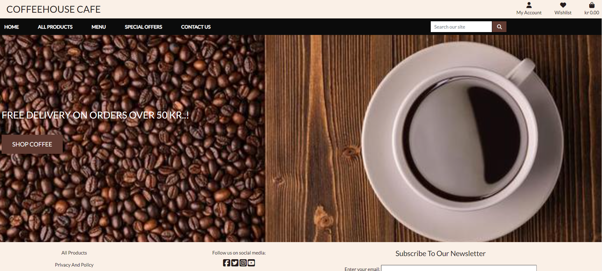

# Project Overview

The coffee house cafe is the coffee shop offering a large number of varieties in coffee and fika snacks. This project is to create an online portal for the coffee shop as many customers are looking for possibility to order online and get the coffee delivered at their doorstep. It will help us in extending the customer base and will provide ease to our customers as well. The website does provide information of all the products, where delivery is possible, along with the options for payments. 

Users must create profile to keep their information avalilable in company's database. After that, they just need to login and place an order in few easy steps as need not to repeat stored information while ordering, for example - favourite items, address, etc.

In this project Django, Python, HTML and CSS are used.

# E-Commerce Business Model
The B2C e-commerce business model is followed here as purpose here is to reach to customers directly. With this website, we as a product owner do have possibility to control the list of items, respective selling price. As customers do place the order, we receive payment and start the delivery process immediately. 

# Project Objectives
Main objectives concluded for this project are following:
- To create a simple, informative and user-friendly user interface for the customers
- To provide possibility for user to create a profile and save his/her information for future use
- Possibility to order with or without login to get delivery at their place after doing payment
- To create a functioning website having information about all the available items in store

# Agile Methodology
As per agile methodology, user stories were added and moved across the workflow as well. Labels were used to define the priority of each user story on the Kanban board. As user stories were completed, they were moved from the To Do, Progress, and Done lists.

# Features

## Home Page

This is the page where customer will land as soon as he/she will go to web url.

## Navigation Bar

Navigation bar has links for different pages on this site to which customer are supposed to navigate through to access related information/activity.

## Products Page

This page has the list of all the products available for customer. Products are as well categorize further for easier navigation for customers.

## Menu Items

Possibility to search items by category

### Hot Coffee Page

All available items, tagged as Hot Coffee type, are added in this page.

### Smoothies

All available items, tagged as Smoothies type, are added in this page.

### Cold Coffee Page

All available items, tagged as Cold Coffee type, are added in this page.

### Summer-special-drink

All available items, tagged as Summer Special type, are added in this page.

### Swedish-fika

All available items, tagged as Swedish Fika type, are added in this page.

## Special offers (combo pack)

All available items, tagged as Combo Pack type, are added in this page.

## Contant Us

This page to provide information for customers to contact seller for any support required.

## Sign up Page

For new users, this page is to provide required information for registration.

## Login page

Existing user to use this page for logging in.

### Order History

Once logged in, user can look at previous order here.

### View/Update User Profile

Users can view and/or update profile information on this page.

## Admin/Superuser

Additional information will be visible for admin at the website.

### Products Management

Using this page, admin has possibility to add products to the board

### Newsletter Page 

This page is only for admin as and when admin need to publish a newsletter to its subscribers.

## Order Cart

This is screen, which will be visible once order will be added to cart.

## Checkout Products

At checkout screen, user can review the order here before proceeding further.

## Delivery Information Page

Once order is reviewed, user has to checkout before proceeding with payment page.

## Payment Page

Payment process completed and confirmation post payment will be as follows.

## Footer

There are few links in the footer of website as well.

### Facebook page 

Here is the social media links available, for example - Facebook.

### Subscribe Page 

Here is the form for users to subscribe for newsletters.

)

### Privacy and Policy page

Privacy and Policy page provides information about customer privacy maintained by us also information about company's policies.

### Terms & Condition page

Here terms and conditions are listed for users to follow as and when required.

### FAQ page

Here are some frequently asked questions by the customers/users.

# Flowchart

The flow of information on the website is as follows.

# Testing

Various test cases were executed throughout the development process to make sure that design is in line with project objective and website is fully functional.

## Functional Testing

|Test ID|Test Summary|Test Steps|Expected Result|Test Status (Ex.1)|Defect|Test Status (Retest)|
|--------|--------|--------|--------|--------|--------|--------|
|TC.001|Website Home Page|Enter website's url in address bar and press enter|Home page of website should get loaded correctly|Pass|None|Pass|
|TC.002|Home Page items|Validate all the information at home page is visible correctly|Nav Bar, Logo, Footer should be visible|Pass|None|Pass|
|TC.003|All products list|Click on 'All Products' link|Validate list of all the products is visible when clicked on the link|Pass|None|Pass|
|TC.004|Menu list|Click on 'Menu' link|List of available menu items should be displayed|Pass|None|Pass|
|TC.005|Hot Coffee link|Click on menu -> 'Hot Coffee' link|Validate list of all the products tagged as Hot Coffee is visible when clicked on the link|Pass|None|Pass|
|TC.006|Smoothie link|Click on menu -> 'Smoothie' menu link|Validate list of all the products tagged as Smoothie is visible when clicked on the link|Pass|None|Pass|
|TC.007|Cold Coffee link|Click on menu -> 'Cold Coffee' menu link|Validate list of all the products tagged as Cold Coffee is visible when clicked on the link|Pass|None|Pass|
|TC.008|Summer Special link|Click on menu -> 'Summer Special' menu link|Validate list of all the products tagged as Summer Special is visible when clicked on the link|Pass|None|Pass|
|TC.009|Swedish Fika link|Click on menu -> 'Swedish Fika' menu link|Validate list of all the products tagged as Swedish Fika is visible when clicked on the link|Pass|None|Pass|
|TC.010|Product list view|Review product list view|Validate the list is visible correctly and user is able to look at all the items listed|Pass|None|Pass|
|TC.011|Special Offers link|Click on 'Special Offers' link|Validate list of all the products tagged as Combo pack is visible when clicked on the link|Pass|None|Pass|
|TC.012|Product list information|Check information for products on the page|Validate that the image along with name, price is at least visible for all the items|Pass|None|Pass|
|TC.013|Product detail information|Click on product image or text|Validate that product name, image, description, price, rating and form to order is visible after clicking at any of those|Fail|BUG.01|Pass|
|TC.014|Add to cart|Select quantity and click on the button 'Add to cart'|Check that product is added to cart once clicked on the button 'Add to cart'|Pass|None|Pass|
|TC.015|Add more to cart|Select different product and click on 'Add to cart'|Cart should get updated with additional product|Pass|None|Pass|
|TC.016|Edit cart - Increase quantity|Go to cart -> increase order quantity -> click on update|Cart should get updated with additional quantity of the product and total price should be updated as well|Pass|None|Pass|
|TC.017|Edit cart - Remove Product|Go to cart -> click on remove for a product|Product should get removed from cart and total price should get updated accordingly|Fail|BUG.02|Pass|
|TC.018|Checkout cart|Click on checkout button in the cart after adding the products|Delivery information screen should be visible for the user|Pass|None|Pass|
|TC.019|Complete order|Click on Complete order after entering delivery and payment information|Order confirmation screen should be visible with the selected products|Pass|None|Pass|
|TC.020|Complete order with no address|Click on Complete order without entering delivery but with payment information|Message should be displayed on the screen for incomplete information|Pass|None|Pass|
|TC.021|Complete order with wrong payment|Click on Complete order after entering delivery and wrong payment information|Message should be displayed on the screen for incomplete information|Pass|None|Pass|
|TC.022|Mail confirmation|Complete a order and check mail|A confirmation mail should be received at mentioned email address|Fail|BUG.03|Pass|
|TC.023|Contact Us link|Click on 'Contact Us' link|Validate that a form opened to fill in the information on contact|Pass|None|Pass|
|TC.024|Contact message sent|Fill in the information on contact us page and click on send message button|A popup should be displayed as message sent|Fail|BUG.04|Pass|
|TC.025|Contact message received|Send a message via contact us screen -> login as admin -> check contact us message|Latest message should be visible on the top of list|Fail|BUG.05|Pass|
|TC.026|My Account link without logged in|Click on 'My Account' link|Items in the link should be register and login|Pass|None|Pass|
|TC.027|My Account -> Register link|Click on 'My Account -> Register' link|A screen with the form for registration should be visible|Pass|None|Pass|
|TC.028|Registration completion|Fill in the information on registration page and click on submit|Registration should be completed successfully|Pass|None|Pass|
|TC.029|Registration mail sent|Check emails after successful registration|A verification mail should be sent to mentioned mail id for user|Pass|None|Pass|
|TC.030|My Account -> Login link|Click on 'My Account -> Login' link|A form for login should be visible|Pass|None|Pass|
|TC.031|Login unsuccessful|Enter wrong login information and click on login|Login failure message should be displayed|Pass|None|Pass|
|TC.032|Login successful|Enter correct login inforamtion and click on login|Success login message should be popped up|Pass|None|Pass|
|TC.033|My Account link with logged in|Click on 'My Account' link after logging in |My Profile and Logout links should be in the list|Pass|None|Pass|
|TC.034|My Account -> My Profile link|Click on 'My Account -> My Profile' link|User's profile information should be popped up|Pass|None|Pass|
|TC.035|Edit profile|Edit some information in profile and click on update|User's profile should be updated accordingly|Pass|None|Pass|
|TC.036|My Account -> Logout|Click on 'My Account -> Logout' link|User should be logged out from website|Pass|None|Pass|
|TC.037|Wishlist link|Add few products to the Wishlist and click on 'Wishlist' link|Product added to Wishlist should be visible|Pass|None|Pass|
|TC.038|Wishlist without login|Open Wishlist without logging in|Message to login should be displayed|Fail|BUG.06|Pass|
|TC.039|Wishlist reduce|Remove one of the products from Wishlist|Wishlist should get update|Pass|None|Pass|
|TC.040|All Products (footer) link|Click on footer -> 'All Product' link|List of all the products should be displayed|Pass|None|Pass|
|TC.041|Privacy and Policy link|Click on footer -> 'Privacy and Policy' link|Privacy and Policy information should be displayed|Pass|None|Pass|
|TC.042|Terms & conditions link|Click on footer -> 'Terms & Condition' link|Terms and conditions should be displayed|Pass|None|Pass|
|TC.043|FAQs link|Click on footer -> 'FAQs' link|FAQ page should be displayed|Pass|None|Pass|
|TC.044|Social media links|Click on footer -> Social Media links|Respective social media page should be opened in new tab|Pass|None|Pass|
|TC.045|Subscription link|Enter mail id and click on subscription button|A message of successful subscription should be popped up|Fail|BUG.07|Pass|
|TC.046|Media screen check|Access all the pages of website on different media screen|All the information should be visible correctly on all the media screens|Fail|BUG.08|Pass|

## Lighthouse Results

## Defects

|Defect ID|Summary|Description|Resolution|Status|
|--------|--------|--------|--------|--------|
|BUG.01|Link on product text not working|Clicking on product name is not opening product description|Link added to product name as well|Fixed|
|BUG.02|Remove product from cart|Total order should be updated when a product is removed|item information was missing on remove button|Fixed|
|BUG.03|Mail confirmation on order|No confirmation mail is sent once order is completed|Mail hander is corrected|Fixed|
|BUG.04|Contact message wrong message|Contact message sent confirmation is not displayed instead error screen showed|Corrected the link on the button|Fixed|
|BUG.05|Contact message sent issue|Message was not received by admin once sent|fix of BUG.04 fixed this as well|Fixed|
|BUG.06|Error screen on Wishlist without login|A wrong error message was being shown when user clicked on Wishlist without logging in|routed to login page if not logged in|Fixed|
|BUG.07|Wrong page displayed upon subscription|Newsletter page was displayed when user is subscribing to newsletter|corrected the url link to show subscription successful|Fixed|
|BUG.08|Subscribe button text|Subscript button text was not visible in centre on different media screens|Set the style value to auto|Fixed|

# Technologies used

Tool/Language Used
- HTML
- CSS
- JavaScript
- Python
- Django
- Heroku
- Bootstrp5
- Stripe (Accept a payment)
- ElephantSQL
- PostgreSQL
- Amazon S3
- Font Awesome

Django Package
- Gunicorn as the server for Heroku
- Dj_database_url to parse the database URL from the environment variables in Heroku
- Psycopg2 as an adaptor for Python and PostgreSQL databases
- Allauth for authentication, registration and account management
- Stripe for processing all online and credit card purchases on the website
- Crispy Forms to style the forms
- Pillow to process and save all the images downloaded through the database

# Deployment

- Create Pipfile

- In the terminal enter the command pip3 freeze > requirements.txt, and a file with all the requirements will be created.

- Setting up Heroku
    - Go to Heroku website
    - Login to Heroku and choose Create App
    - Click New and Create a new app
    - Choose a name and select your location
    - Go to the Resources tab
    - From the Resources list select Heroku Postgres
    - Navigate to the Deploy tab
    - Click on Connect to Github and search for your repository
    - Navigate to the Settings tab
    - Reveal Config Vars and add your AWS_ACCESS_KEY_ID,AWS_SECRET_ACCESS_KEY,EMAIL_HOST_PASS,EMAIL_HOST_USER,STRIPE_PUBLIC_KEY, 
      STRIPE_SECRET_KEY,STRIPE_WH_SECRET,USE_AWS, Database URL (from Heroku-Postgres) and Secret key.

- Deployment on Heroku
    - Go to the Deploy tab.
    - Choose the main branch for deploying and enable automatic deployment
    - Select manual deploy for building the App
    - Wait until build is complete
    - Click on Open App button
    - Website launched now 
    - Deployment link: https://coffeehouse-fee0be3a9012.herokuapp.com/
